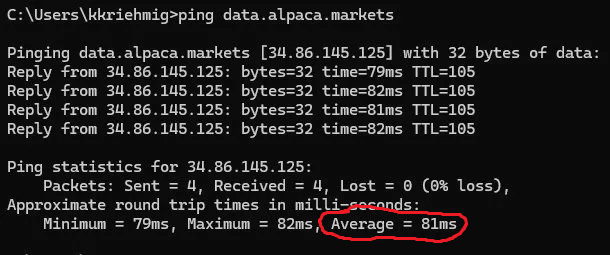
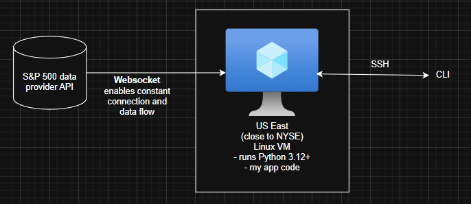

# Low-Latency Trading System, what it does:

I deployed a high-performance VM as close as I can to the NYSE. The physical proximity is what makes my ping faster than my local device that is located in Ireland.

## Latency Results (pings)
- **My Laptop (Dublin) → S&P data**: 81ms average
- **My VM (East US VM) → S&P data**: 6ms average (92% latency reduction from my laptop)
- **Citadel → S&P data**: likely <1ms

My Laptop:

Azure Machine:

## Infrastructure 

# Setup
1. create Alpaca account for live stock data, get API keys for paper trading from your dashboard
2. clone repo in VS code
3. in VS terminal bash: pip install -r requirements.txt
4. in VS terminal bash:
   $env:ALPACA_API_KEY="your-key-here"
   $env:ALPACA_SECRET_KEY="your-secret-here"
5. test ping time

